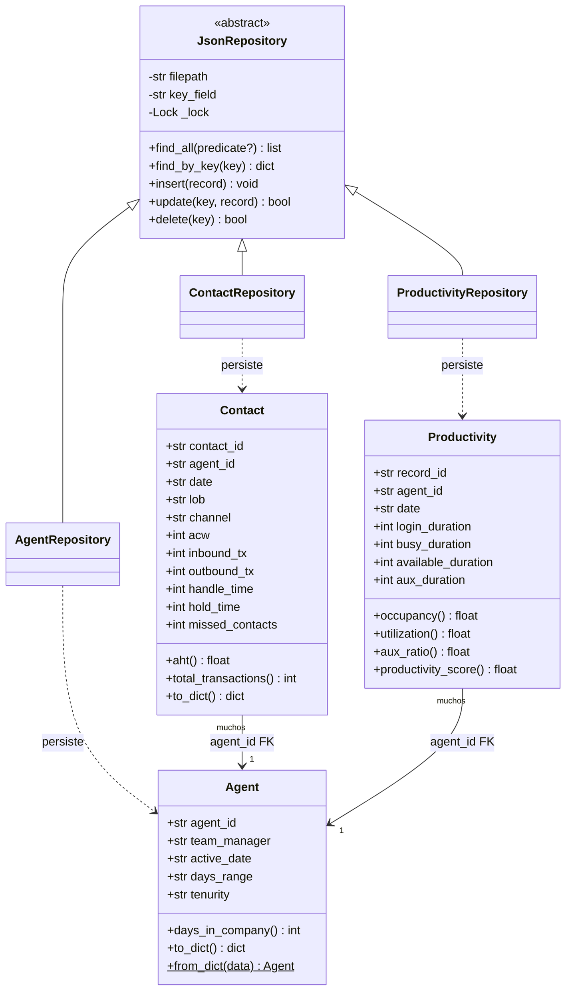
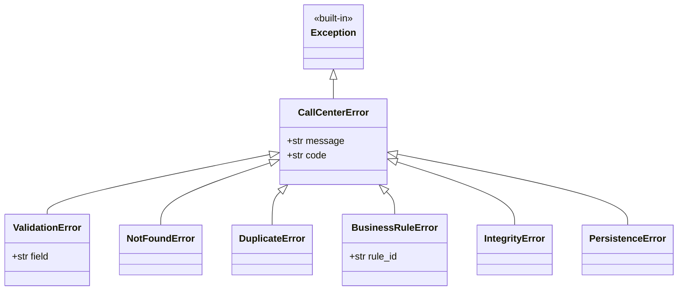
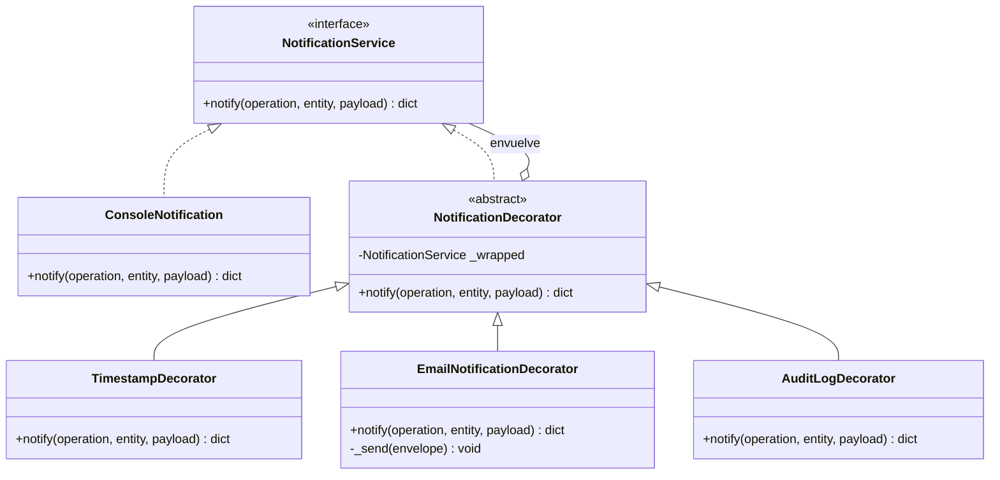
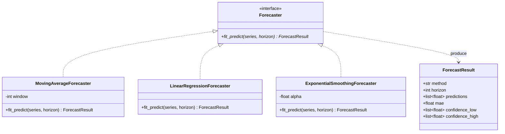
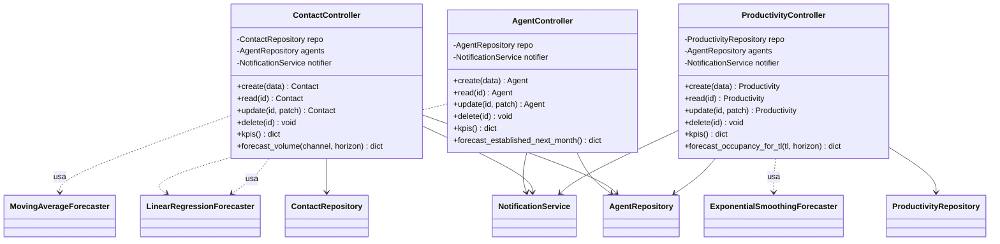
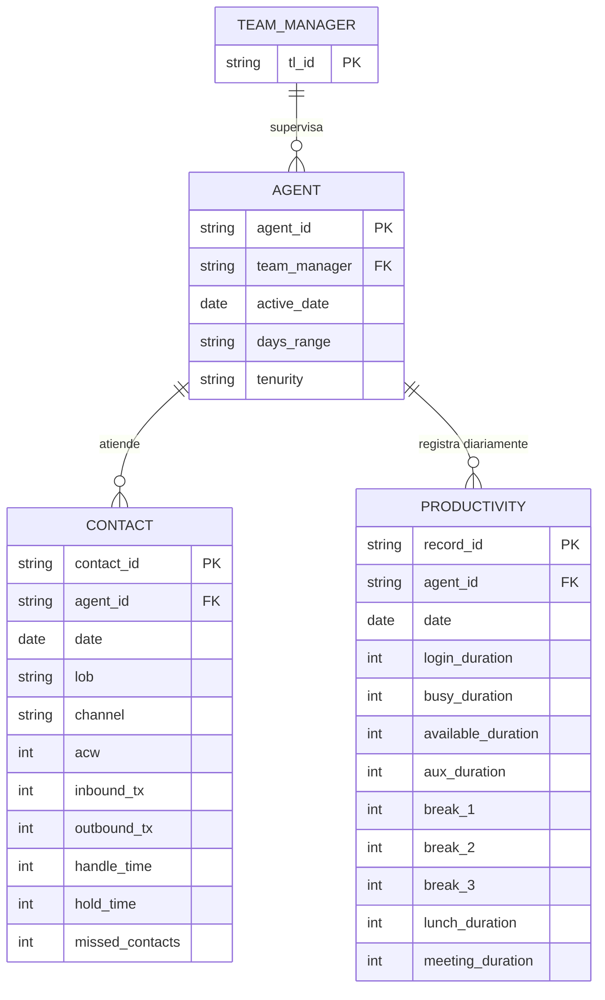
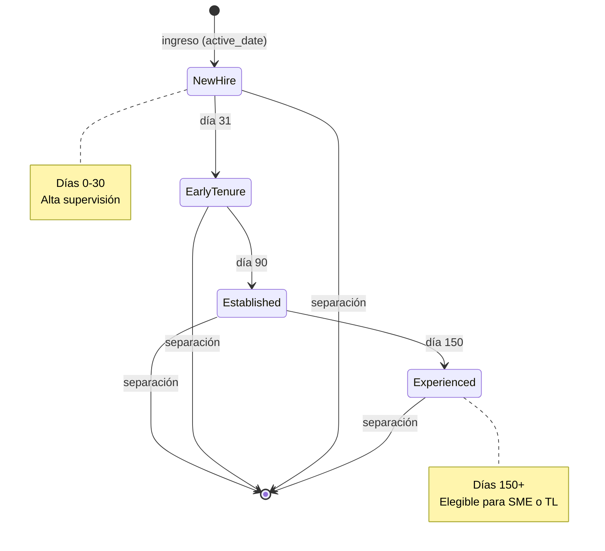
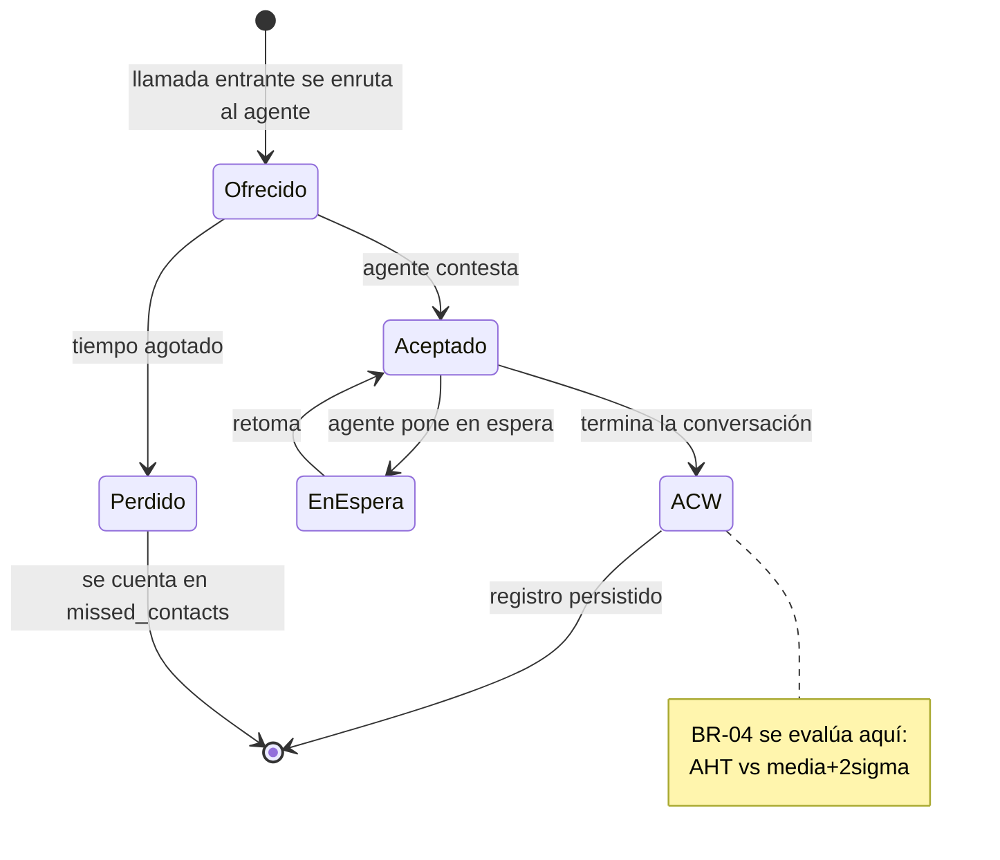
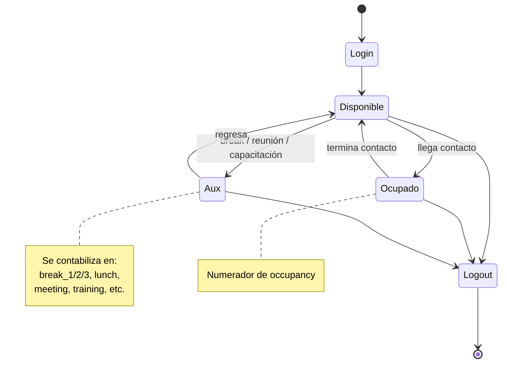
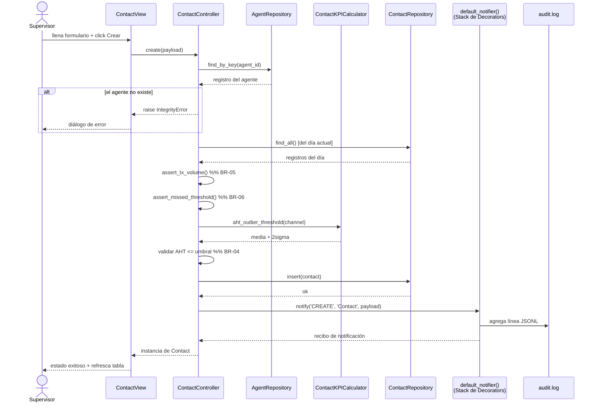

# Call Center Management System

> Plataforma de gestión de fuerza laboral, operaciones y productividad
> para un BPO automotriz.
> Proyecto Final — Programación II.

Aplicación de escritorio para gestionar 2,500+ agentes, registrar
contactos de clientes por teléfono / chat / email, monitorear
productividad, calcular KPIs estándar de la industria y pronosticar
volumen y ocupación.

---

## Tabla de Contenidos

- [Call Center Management System](#call-center-management-system)
  - [Tabla de Contenidos](#tabla-de-contenidos)
  - [Inicio Rápido](#inicio-rápido)
  - [Arquitectura](#arquitectura)
  - [Diagramas de Clases](#diagramas-de-clases)
    - [1. Entidades del Dominio y Repositorios](#1-entidades-del-dominio-y-repositorios)
    - [2. Jerarquía de Excepciones Personalizadas](#2-jerarquía-de-excepciones-personalizadas)
    - [3. Servicio de Notificación (Decorator GoF)](#3-servicio-de-notificación-decorator-gof)
    - [4. Pronóstico (Patrón Strategy)](#4-pronóstico-patrón-strategy)
    - [5. Controladores (Capa de Aplicación)](#5-controladores-capa-de-aplicación)
  - [Modelo de Datos (ER)](#modelo-de-datos-er)
  - [Diagramas de Estado](#diagramas-de-estado)
    - [Ciclo de Vida del Agente (rige BR-02: progresión de tenurity)](#ciclo-de-vida-del-agente-rige-br-02-progresión-de-tenurity)
    - [Ciclo de Vida de un Contacto (por registro)](#ciclo-de-vida-de-un-contacto-por-registro)
    - [Día de Productividad (por agente / día)](#día-de-productividad-por-agente--día)
  - [Diagrama de Secuencia — Registrar Contacto](#diagrama-de-secuencia--registrar-contacto)
  - [Mapa de Procesos (resumen BPMN)](#mapa-de-procesos-resumen-bpmn)
  - [Estructura del Proyecto](#estructura-del-proyecto)
  - [Cómo Ejecutar el Sistema](#cómo-ejecutar-el-sistema)
  - [Pruebas](#pruebas)
  - [Equipo y Responsabilidades](#equipo-y-responsabilidades)
  - [Limitaciones Conocidas](#limitaciones-conocidas)

---

## Inicio Rápido

```bash
# 1. Clonar y entrar al proyecto
git clone <repo-url> && cd call_center_system

# 2. (Opcional) entorno virtual
python -m venv .venv && source .venv/bin/activate

# 3. Instalar dependencias
pip install -r requirements.txt

# 4. Cargar los CSVs fuente a JSON (ETL única vez)
python scripts/etl_csv_to_json.py \
    --source-dir ./raw_csvs \
    --out-dir ./data

# 5. Lanzar la GUI
python app.py

# 6. Correr las pruebas
python -m pytest tests/ -v
```

---

## Arquitectura

El sistema está organizado en cuatro capas. Las dependencias fluyen
**solo hacia abajo**: presentación depende de aplicación, aplicación
depende de dominio, dominio depende de abstracciones de infraestructura.

```
+----------------------+
|    Presentación      |  tkinter + matplotlib
|    views/, app.py    |
+----------+-----------+
           |
+----------v-----------+
|    Aplicación        |  orquestación de casos de uso
|    controllers/      |
+----+---------+-------+
     |         |
+----v---+ +---v----------+
| Dominio| |  Analítica   |  KPIs + pronosticadores
| models | |  kpis/       |
| rules  | |  forecast/   |
+----+---+ +-------+------+
     |             |
+----v-------------v-----+
|    Infraestructura     |  repo JSON, decorators, logging
|    persistence/        |
|    services/           |
+------------------------+
```

**Patrones aplicados**: MVC, Repository, DTO, Decorator (GoF), Strategy.

---

## Diagramas de Clases

El sistema se divide en cuatro subsistemas cohesivos. Cada diagrama de
abajo se enfoca en uno de ellos; juntos describen todo el código.

### 1. Entidades del Dominio y Repositorios



### 2. Jerarquía de Excepciones Personalizadas



### 3. Servicio de Notificación (Decorator GoF)



La pila canónica de decoradores compuesta por `default_notifier()`:

```
AuditLogDecorator( EmailNotificationDecorator( TimestampDecorator( ConsoleNotification() ) ) )
```

### 4. Pronóstico (Patrón Strategy)



### 5. Controladores (Capa de Aplicación)



---

## Modelo de Datos (ER)



**Cardinalidades**

| De | A | Regla |
|----|---|-------|
| Agent → Contact | 1 a muchos | Un agente atiende muchos registros de contacto (uno por agente/día/canal/LOB). |
| Agent → Productivity | 1 a muchos | Un registro de productividad por agente por día. |
| Team Manager → Agent | 1 a muchos | Un TL supervisa máximo 15 agentes (BR-01). |

---

## Diagramas de Estado

### Ciclo de Vida del Agente (rige BR-02: progresión de tenurity)



### Ciclo de Vida de un Contacto (por registro)



### Día de Productividad (por agente / día)



---

## Diagrama de Secuencia — Registrar Contacto

Flujo end-to-end del caso de uso **UC-02: Registrar Contacto**. Muestra
cómo se encadenan validación, reglas de negocio, persistencia,
notificación y el log de auditoría.



---

## Mapa de Procesos (resumen BPMN)

El diagrama BPMN 2.0 completo está en `docs/bpmn_diagram.png`. A
continuación un resumen narrativo de los cuatro casos de uso primarios.

| UC | Nombre | Disparador | Camino principal | Camino de excepción |
|----|--------|------------|------------------|---------------------|
| UC-01 | Onboarding de Agente | Ingreso de nuevo agente | Validar ID → verificar capacidad TL → persistir → notificar | BR-01: TL lleno → reasignar |
| UC-02 | Registrar Contacto | Carga diaria de contactos | Validar FK → revisar volumen/missed → revisar AHT atípico → persistir → notificar | BR-04/05/06 lanza excepción |
| UC-03 | Revisión Diaria de Productividad | Fin de turno | Validar suma de estados → calcular KPIs → marcar si occupancy baja | BR-07/09 lanza excepción |
| UC-04 | Pronóstico de Volumen | Petición del workforce | Agregar por canal → correr MA + LinReg → elegir menor MAE → renderizar gráfica | Serie muy corta → toast de error |

---

## Estructura del Proyecto

```
call_center_system/
├── app.py                       # punto de entrada
├── config.py                    # rutas, umbrales, configuración de email
├── requirements.txt
├── README.md                    # este archivo
├── docs/
│   ├── bpmn_diagram.png
│   ├── class_diagram.png        # exportado del Mermaid de arriba
│   ├── state_diagram.png
│   └── informe_final.docx
├── data/                        # generado por ETL, gitignored
│   ├── roster.json
│   ├── contacts.json
│   ├── productivity.json
│   └── audit.log
├── scripts/
│   └── etl_csv_to_json.py
├── domain/
│   ├── models/      {agent,contact,productivity}.py
│   ├── rules/       {agent,contact,productivity}_rules.py
│   └── exceptions/  custom_exceptions.py
├── infrastructure/
│   ├── persistence/ json_repository.py + 3 repositorios concretos
│   └── services/    notification.py, logger.py
├── analytics/
│   ├── kpis/        {agent,contact,productivity}_kpis.py
│   └── forecast/    base.py, moving_average.py, linear_regression.py,
│                    exp_smoothing.py
├── controllers/     {agent,contact,productivity}_controller.py
├── views/
│   ├── main_view.py
│   ├── {agent,contact,productivity}_view.py
│   └── widgets/     kpi_card.py, forecast_chart.py
└── tests/
    ├── unit/        test_*_model.py, test_forecasters.py, ...
    └── integration/ test_repository_roundtrip.py, test_controller_flow.py
```

---

## Cómo Ejecutar el Sistema

```bash
# Lanzar la GUI
python app.py

# Volver a correr ETL después de refrescar los CSVs
python scripts/etl_csv_to_json.py
```

**Atajos de teclado (cualquier pestaña)**

| Atajo | Acción |
|-------|--------|
| `Ctrl + N` | Nuevo registro |
| `Ctrl + S` | Guardar formulario |
| `Ctrl + F` | Ejecutar pronóstico |
| `F5`       | Refrescar tabla |
| `Delete`   | Eliminar fila seleccionada (con confirmación) |

---

## Pruebas

```bash
# Todas las pruebas, en modo verbose
python -m pytest tests/ -v

# Un archivo específico
python -m pytest tests/unit/test_forecasters.py -v

# Con cobertura (opcional)
pip install pytest-cov
python -m pytest tests/ --cov=domain --cov=analytics --cov-report=term
```

Meta: **50+ pruebas pasando**, con mínimo 10 pruebas unitarias por desarrollador.

---

## Equipo y Responsabilidades

| Desarrollador | Rama | Responsable de |
|---------------|------|----------------|
| Dev 1 | `feature/workforce` | Entidad Agent, BR-01/02/03, KPIs de headcount, pronóstico de tenurity, shell de la GUI |
| Dev 2 | `feature/contacts` | Entidad Contact, BR-04/05/06, KPIs de AHT/missed, pronóstico de volumen |
| Dev 3 | `feature/productivity` + `feature/forecasting` | Entidad Productivity, BR-07/08/09, KPIs de occupancy, los tres pronosticadores |

Ver la sección 14 de la guía de desarrollo PDF para el plan completo de los 42 commits.

---

## Limitaciones Conocidas

- **La persistencia JSON** funciona bien para un proyecto académico pero
  no escala más allá de unos cientos de miles de registros. Para
  producción, cambiar `JsonRepository` por una implementación SQLite o
  PostgreSQL detrás de la misma interfaz.
- **El email está simulado** — el `EmailNotificationDecorator` imprime
  a stdout en lugar de abrir una conexión SMTP. El contrato es el
  mismo; solo cambia el método `_send()`.
- **Los pronosticadores son univariados**. No modelan estacionalidad
  por día de la semana ni patrones específicos por LOB. Holt-Winters
  o SARIMA serían el siguiente paso natural.
- **La GUI es monousuario**. Las ediciones concurrentes entre procesos
  no se coordinan; el lock del archivo solo protege threads dentro del
  mismo proceso.

---
