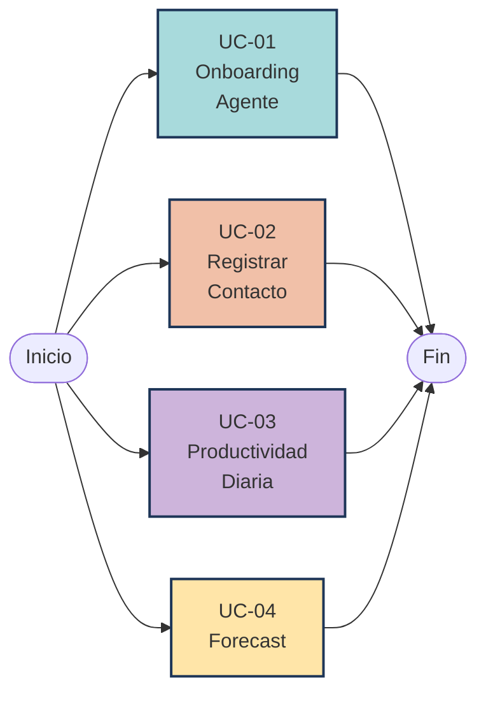
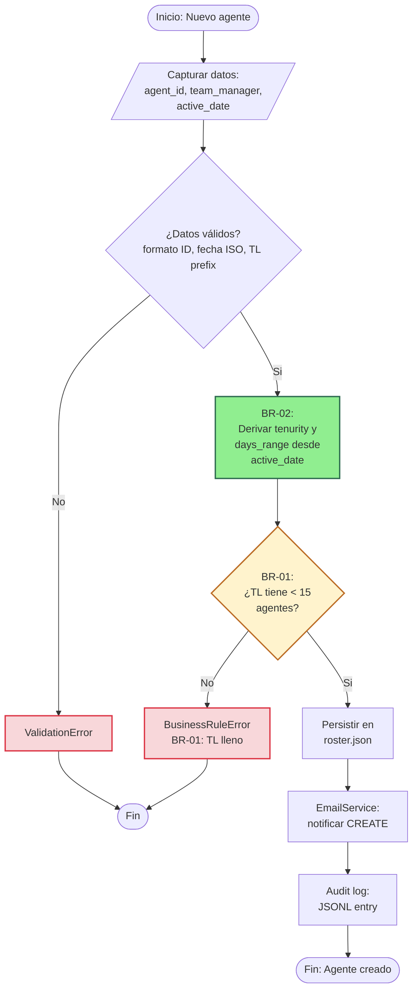
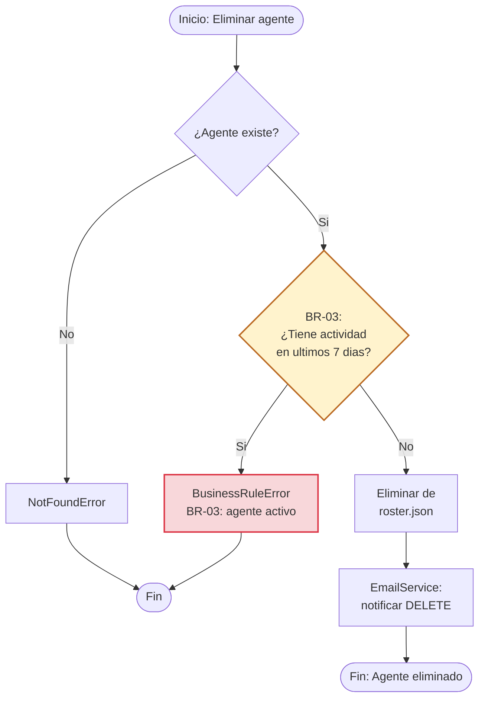
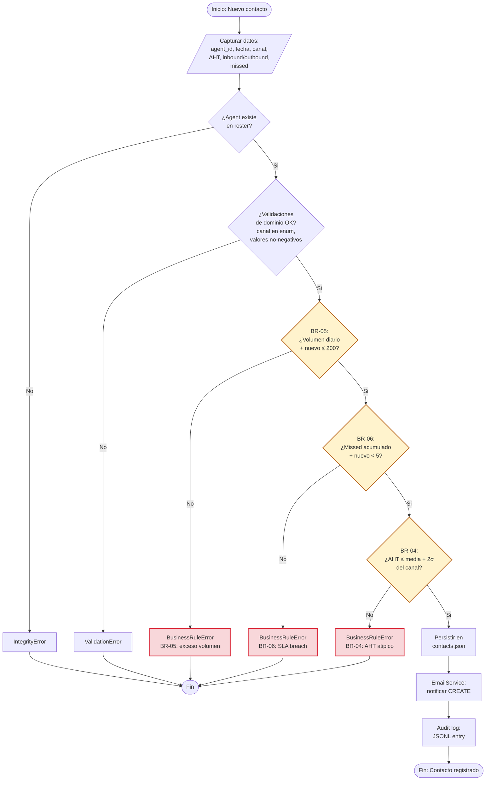
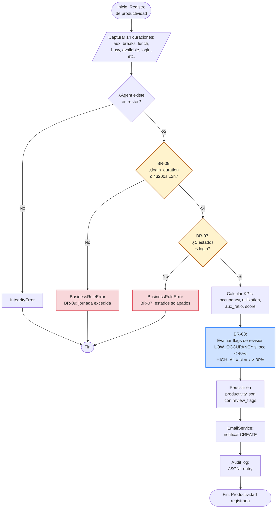
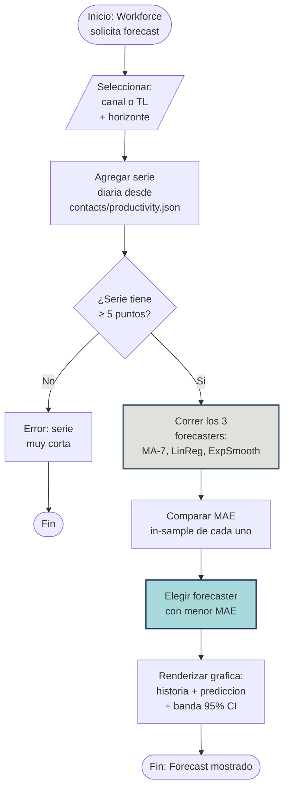

# Mapa de Procesos — BPMN 2.0

> Diagrama de procesos del Call Center Management System usando notación
> BPMN 2.0 representada en Mermaid. Muestra los 4 casos de uso primarios
> y marca explícitamente las 9 reglas de negocio (BR-01 a BR-09).

---

## Vista general del sistema

---

## UC-01 — Onboarding de Agente

Reglas evaluadas: **BR-01, BR-02, BR-03**

**Camino alterno: Eliminar agente (evalúa BR-03)**

---

## UC-02 — Registrar Contacto

Reglas evaluadas: **BR-04, BR-05, BR-06**

---

## UC-03 — Productividad Diaria

Reglas evaluadas: **BR-07, BR-08, BR-09**

> Nota: BR-08 (en azul) es **informativa, no bloqueante**. El registro se persiste igual, pero queda marcado.

---

## UC-04 — Forecast de Volumen / Ocupación

Sin reglas de negocio asociadas — es un caso de uso de analítica pura.

---

## Trazabilidad de reglas en los procesos

Tabla cruzada que verifica que cada regla aparece explícita en al menos un proceso BPMN:

| Regla | Proceso | Tipo de nodo | Dueño |
|-------|---------|--------------|-------|
| BR-01 | UC-01 | Gateway (rombo) | Juan David |
| BR-02 | UC-01 | Activity (rectángulo) | Juan David |
| BR-03 | UC-01 (eliminar) | Gateway | Juan David |
| BR-04 | UC-02 | Gateway | Luna |
| BR-05 | UC-02 | Gateway | Luna |
| BR-06 | UC-02 | Gateway | Luna |
| BR-07 | UC-03 | Gateway | Lorena |
| BR-08 | UC-03 | Activity (no bloqueante) | Lorena |
| BR-09 | UC-03 | Gateway | Lorena |

---

## Convenciones del diagrama

- **Rombos amarillos** (`BR-XX`) — Decisiones que aplican una regla de negocio bloqueante
- **Cajas verdes** — Actividades de derivación automática
- **Cajas azules** — Reglas informativas (no bloquean el flujo)
- **Cajas rojas** — Estados de error (lanzan excepción)
- **Cajas grises/aqua** — Procesamiento técnico (cálculos, persistencia)

---

*Diagramas BPMN en Mermaid — generados para la entrega final.*
