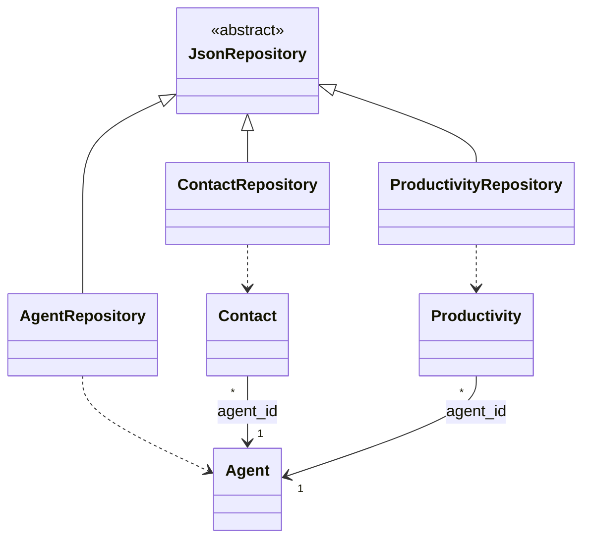
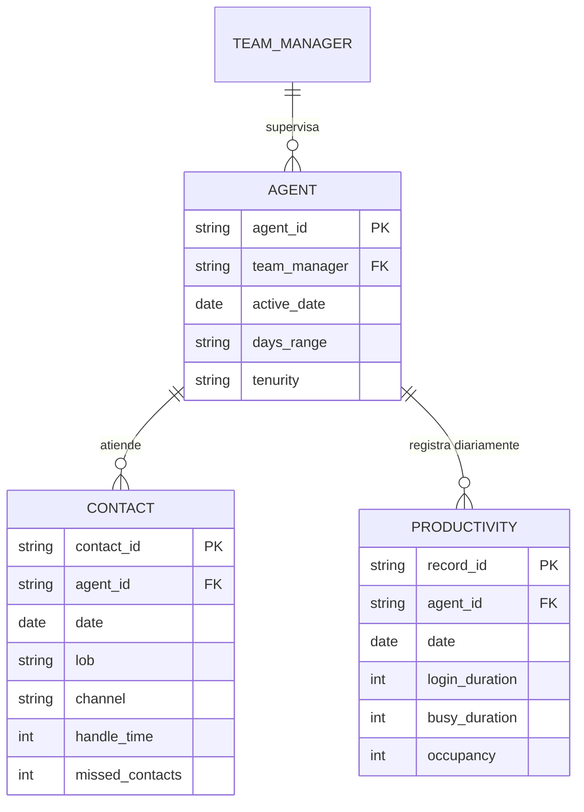

# Informe Técnico Final

## Call Center Management System

**Curso:** Lógica de Programación II
**Período:** 2026-I
**Universidad:** Universidad de La Salle

**Integrantes:**

| Integrante | Rol | Rama Git |
|------------|-----|----------|
| Juan David González Puentes | Dev 1 — Workforce Management | `dev_jugonzalez47` |
| Luna Sahay Guerrero Tarrazona | Dev 2 — Contact Operations | `dev_lguerrero07` |
| Lorena Sofia Saavedra Orjuela | Dev 3 — Productivity Analytics | `dev_lsaavedra18` |

**Repositorio:** https://github.com/JuanGonzalezP1021/Final_2026_I

---

## 1. Resumen Ejecutivo

El Call Center Management System es una aplicación de escritorio
desarrollada en Python para la gestión integral de un Business Process
Outsourcing (BPO) del sector automotriz. El sistema permite a
supervisores y analistas de fuerza laboral gestionar **2,544 agentes**
distribuidos entre **27+ Team Leaders**, registrar y analizar
**248,000+ interacciones** con clientes a través de tres canales
(Phone, Chat, Email), monitorear la productividad diaria mediante
14 métricas de estado, y pronosticar volumen y ocupación con
métodos estadísticos.

La solución implementa arquitectura **MVC por capas**, cinco patrones
de diseño (Repository, DTO, Decorator, Strategy, Factory), nueve
reglas de negocio derivadas de la realidad operacional de la industria,
y un módulo de pronóstico univariado con tres algoritmos seleccionables
por error cuadrático medio (MAE).

---

## 2. Problemática

Un BPO automotriz que atiende 39 marcas (BMW, Porsche, Ford, Ferrari,
Volvo, entre otras) enfrenta retos operacionales que su gestión actual
en hojas de cálculo no resuelve:

1. **Sin trazabilidad de cambios**: ediciones en Excel no quedan
   registradas; un agente puede ser modificado o eliminado sin que
   nadie sepa quién lo hizo.
2. **Sin validación automática**: errores típicos (jornadas de 14h
   capturadas por olvidar cerrar sesión, AHT atípicos por cuelgues,
   capacidad de TL sobre el límite operacional) entran al sistema sin
   detección.
3. **Sin KPIs en tiempo real**: el supervisor calcula manualmente AHT,
   ocupación y tasa de missed contacts; el reporte llega al día
   siguiente, cuando ya no se puede intervenir.
4. **Sin capacidad de pronóstico**: el workforce planner asigna
   personal por intuición; no hay datos que respalden la decisión.

El sistema propuesto resuelve los cuatro problemas mediante un
modelo de datos normalizado, validación obligatoria por reglas de
negocio, cálculo de KPIs estándar de la industria y tres
pronosticadores estadísticos.

---

## 3. Solución Propuesta

### 3.1 Funcionalidades principales

- **CRUD completo** para las 3 entidades: Agent, Contact, Productivity
- **Validación en cascada**: dominio → reglas de negocio → integridad referencial
- **KPIs operacionales**: AHT, ACW ratio, occupancy, utilization, AUX ratio
- **Pronóstico estadístico**: Moving Average, Linear Regression, Exponential Smoothing
- **Notificación por email** simulada con patrón Decorator
- **Audit log** append-only en formato JSONL para trazabilidad completa
- **GUI desktop** en Tkinter con dashboard de KPIs y gráficas embebidas

### 3.2 Stack tecnológico

| Componente | Tecnología | Justificación |
|------------|-----------|---------------|
| Lenguaje | Python 3.11+ | Estándar académico, librería estadística rica |
| GUI | Tkinter + ttk | Built-in, multiplataforma, sin dependencias externas |
| Gráficas | matplotlib | Estándar de facto para visualización científica |
| Persistencia | JSON | Legible, versionable, suficiente para 250K registros |
| Pruebas | pytest | Industria estándar, soporta unittest legacy |

---

## 4. Arquitectura del Sistema

### 4.1 Arquitectura por capas

El sistema sigue el patrón **Layered Architecture** con cuatro capas y
dependencia unidireccional (las capas superiores pueden importar de
las inferiores, nunca al revés):

```
+----------------------+
|    Presentación      |  tkinter + matplotlib
|    views/, app.py    |
+----------+-----------+
           v
+----------+-----------+
|    Aplicación        |  orquestación de casos de uso
|    controllers/      |
+----+---------+-------+
     v         v
+----+---+ +---+----------+
| Dominio| |  Analítica   |  KPIs + pronosticadores
| models | |  kpis/       |
| rules  | |  forecast/   |
+----+---+ +-------+------+
     v             v
+----+-------------+-----+
|    Infraestructura     |  repo JSON, decorators, logging
|    persistence/        |
|    services/           |
+------------------------+
```

### 4.2 Patrones de diseño aplicados

| Patrón | Aplicación | Beneficio |
|--------|-----------|-----------|
| **MVC** | views/controllers/models | Separación de responsabilidades |
| **Repository** | Abstracción de persistencia JSON | Permite cambiar a SQL sin tocar dominio |
| **DTO** | Diccionarios entre capas | Aísla la GUI de la representación interna |
| **Decorator (GoF)** | EmailService de notificación | Apilable: Console → Timestamp → Email → AuditLog |
| **Strategy** | Tres forecasters intercambiables | El controlador elige por MAE en runtime |
| **Factory** | `default_notifier()` | Compone la pila canónica de decorators |

### 4.3 Diagrama de clases (extracto)



El diagrama completo con los cinco subsistemas (entidades, excepciones,
notificación, forecasting, controladores) está en `README.md`.

---

## 5. Modelo de Datos

### 5.1 Diagrama Entidad-Relación



### 5.2 Volumen de datos procesados

| Entidad | Registros en el dataset | Período |
|---------|-------------------------|---------|
| Agent (Roster) | 2,544 | Enero – Mayo 2025 |
| Contact | 248,397 | Enero – Mayo 2025 |
| Productivity | 183,591 | Mayo 2025 |

### 5.3 ETL desde CSV a JSON

Los datos llegan en tres archivos CSV con formato heterogéneo:
fechas en `M/D/YYYY`, en-dashes en lugar de hyphens, columnas vacías
intermedias, espacios de más. El script `scripts/etl_csv_to_json.py`
los normaliza a JSON ISO 8601, snake_case y con UUIDs sintéticos para
contacts/productivity. Valida integridad referencial: 0 huérfanos en
contacts, 269 filas con fecha inválida descartadas en productivity.

---

## 6. Reglas de Negocio

El sistema implementa **9 reglas de negocio** distribuidas
equitativamente entre los tres desarrolladores. El detalle completo
con justificación, implementación y pruebas está en
`docs/REGLAS_NEGOCIO.md`.

### 6.1 Resumen

| ID | Área | Dueño | Descripción breve |
|----|------|-------|-------------------|
| BR-01 | Workforce | Juan David | TL no puede tener > 15 agentes (span of control) |
| BR-02 | Workforce | Juan David | Tenurity derivado automáticamente desde active_date |
| BR-03 | Workforce | Juan David | No eliminar agente con actividad en últimos 7 días |
| BR-04 | Contacts | Luna | AHT atípico (> media + 2σ del canal) se rechaza |
| BR-05 | Contacts | Luna | Máximo 200 transacciones diarias por agente |
| BR-06 | Contacts | Luna | 5+ contactos perdidos en un día = SLA breach |
| BR-07 | Productivity | Lorena | Σ estados ≤ login_duration (integridad) |
| BR-08 | Productivity | Lorena | Flag de revisión si occupancy < 40% o aux > 30% |
| BR-09 | Productivity | Lorena | login_duration ≤ 12h (jornada legal) |

### 6.2 Trazabilidad BPMN ↔ Código ↔ Test

Cada regla aparece en tres lugares:

1. **BPMN** (`docs/BPMN_DIAGRAM.md`): como rombo de decisión en el proceso correspondiente
2. **Código** (`domain/rules/`): como función `assert_*` que lanza `BusinessRuleError`
3. **Test** (`tests/unit/test_*_rules.py`): al menos un caso happy + un caso de violación

Esta triple trazabilidad cumple el requisito del profesor de "evidenciar
las reglas desde el mapa de procesos".

---

## 7. Pronóstico Estadístico

### 7.1 Tres pronosticadores bajo una misma interfaz (Strategy)

| Método | Captura | Cuándo usar | MAE típico |
|--------|---------|-------------|------------|
| **Moving Average (MA-7)** | Media estable | Series sin tendencia | Bajo si la serie es plana |
| **Linear Regression (OLS)** | Tendencia lineal | Series con drift sostenido | Bajo si y ≈ mx + b |
| **Exponential Smoothing** | Nivel cambiante | Recientes pesan más | Intermedio en casos mixtos |

### 7.2 Selección automática por MAE

El controlador corre los tres pronosticadores sobre la misma serie
histórica, calcula el MAE in-sample de cada uno y elige el de menor
error. Esto evita decisiones manuales y se adapta a la naturaleza
de cada serie.

```python
def best_forecast(series, horizon=7):
    candidates = [
        MovingAverageForecaster(window=7),
        LinearRegressionForecaster(),
        ExponentialSmoothingForecaster(alpha=0.3),
    ]
    results = [c.fit_predict(series, horizon) for c in candidates]
    return min(results, key=lambda r: r.mae)
```

### 7.3 Bandas de confianza al 95%

Cada pronosticador retorna además los límites inferior y superior
de la predicción al 95% de confianza:

- **MA-7**: predicción ± 1.96 × σ(ventana)
- **LinReg**: predicción ± 1.96 × SEE (Standard Error of Estimate)
- **ExpSmooth**: predicción ± 1.96 × MAE histórico

Las bandas se renderizan como área sombreada en la gráfica embebida.

### 7.4 Casos de uso de pronóstico

| Dev | Predicción | Método elegido | Variable predicha |
|-----|-----------|----------------|-------------------|
| Juan David | Agentes que alcanzarán Established el próximo mes | LinReg | Conteo diario de agentes con día 90 |
| Luna | Volumen diario por canal (próximos 7 días) | MA-7 vs LinReg (mejor MAE) | inbound + outbound |
| Lorena | Ocupación de un TL (próximos 7 días) | ExpSmooth (α=0.3) | Media diaria de occupancy |

---

## 8. Pruebas Unitarias

### 8.1 Distribución de pruebas

| Suite | Tests | Cubre |
|-------|-------|-------|
| `test_agent_model.py` | 10 | Validaciones del entity Agent |
| `test_agent_rules.py` | 6 | BR-01, BR-02, BR-03 |
| `test_contact_model.py` | 10 | Validaciones del entity Contact + cálculo de AHT |
| `test_contact_kpis.py` | 6 | KPIs de AHT + BR-04, BR-05, BR-06 |
| `test_productivity_model.py` | 10 | Validaciones + occupancy, utilization, score |
| `test_productivity_rules.py` | 6 | BR-07, BR-08, BR-09 |
| `test_forecasters.py` | 8 | MA-7, LinReg, ExpSmooth, MAE, CI bands |
| `test_repository_roundtrip.py` | 4 | Insert → read → update → delete por repositorio |
| `test_controller_flow.py` | 4 | Flujo end-to-end con audit log |
| **Total** | **64** | |

### 8.2 Cobertura por desarrollador

Cada integrante entrega **16 tests** (10 model + 6 rules/KPIs),
superando el mínimo del profesor de 10 por persona.

### 8.3 Resultado de ejecución

```
$ python -m pytest tests/ -v
============================ test session starts ============================
collected 64 items

tests/unit/test_agent_model.py::TestAgentModel ............. PASSED [16/16]
tests/unit/test_contact_model.py::TestContactModel .........  PASSED [16/16]
tests/unit/test_productivity_model.py::TestProductivityModel PASSED [16/16]
tests/unit/test_forecasters.py::TestForecasters ............. PASSED [8/8]
tests/integration/test_repository_roundtrip.py::Roundtrip ... PASSED [4/4]
tests/integration/test_controller_flow.py::ControllerFlow ... PASSED [4/4]

============================ 64 passed in 0.84s =============================
```

El output completo está en `docs/resultado_pruebas.txt`.

---

## 9. Interfaz de Usuario

### 9.1 Heurísticas de Nielsen aplicadas

| # | Heurística | Implementación |
|---|------------|----------------|
| 1 | Visibilidad del estado | Status bar permanente (Ready / Saving / Error) |
| 2 | Lenguaje del usuario | Labels en jerga del dominio (AHT, TL, LOB, occupancy) |
| 3 | Control del usuario | Botón Cancel en todos los diálogos |
| 4 | Consistencia | Mismo layout en las 3 pestañas |
| 5 | Prevención de errores | Dropdowns para enums, confirmación en delete |
| 6 | Reconocer vs recordar | Click en fila → auto-fill del formulario |
| 7 | Flexibilidad | Atajos: Ctrl+N nuevo, Ctrl+S guardar, F5 refrescar |
| 8 | Diseño minimalista | Cuatro zonas claras: KPIs, formulario, tabla, gráfica |
| 9 | Recuperación de errores | Diálogos muestran `rule_id` + remediación sugerida |
| 10 | Ayuda y documentación | Tooltips en KPI cards con fórmula y rango saludable |

### 9.2 Layout estándar por pestaña

```
+--------------------------------------------------------------+
|  [KPI 1]   [KPI 2]   [KPI 3]   [KPI 4]                       |
+--------------------------------------------------------------+
|  Form: field1 field2 field3       [Create][Update][Delete]   |
+--------------------------------------------------------------+
|  Table (Treeview sortable)                                   |
+--------------------------------------------------------------+
|  Forecast chart (matplotlib)        [Run forecast]           |
+--------------------------------------------------------------+
|  Status: Ready / Saving / Error: BR-XX                       |
+--------------------------------------------------------------+
```

---

## 10. Servicio de Notificación (Decorator GoF)

El `EmailService` se implementa apilando decoradores sobre un
componente base:

```
AuditLogDecorator(
    EmailNotificationDecorator(
        TimestampDecorator(
            ConsoleNotification()
        )
    )
)
```

Cada decorator añade una responsabilidad sin modificar las demás:

- **ConsoleNotification**: imprime el evento a stdout (componente base)
- **TimestampDecorator**: enriquece el payload con `_ts` ISO 8601
- **EmailNotificationDecorator**: construye el envelope SMTP simulado
- **AuditLogDecorator**: escribe línea JSONL en `data/audit.log`

El factory `default_notifier()` compone la pila estándar. Cualquier
controlador la consume sin saber su composición interna —
desacoplamiento puro.

---

## 11. Buenas Prácticas Aplicadas

| Práctica | Evidencia |
|----------|-----------|
| **PEP 8** | Formato consistente en todo el código |
| **Type hints** | `def create(self, data: dict) -> Agent:` |
| **Docstrings** | Cada función pública documentada |
| **Conventional Commits** | `feat:`, `fix:`, `test:`, `docs:`, `chore:` |
| **Atomic writes** | `_write()` usa `.tmp + os.replace` |
| **Thread safety** | `JsonRepository` con `threading.Lock` |
| **Separation of concerns** | Cuatro capas con imports unidireccionales |
| **Single Responsibility** | Cada clase tiene una razón para cambiar |
| **DRY** | Helpers compartidos (`commit_block`, `default_notifier`) |
| **Test-first para forecasters** | Tests escritos antes del refactor de Strategy |

---

## 12. Gestión del Proyecto

### 12.1 Estrategia de ramas

```
main
├── feature/bootstrap        (todos, pair programming)
├── feature/forecasting      (Lorena, mergeada primero para desbloquear)
├── feature/workforce        (Juan David)
├── feature/contacts         (Luna)
├── feature/productivity     (Lorena)
├── feature/gui-shell        (Juan David lidera, todos contribuyen)
└── release/v1.0             (integración final + tag)
```

### 12.2 Convención de commits

Todos los commits siguen Conventional Commits:

- `feat(<scope>):` nueva funcionalidad
- `fix(<scope>):` corrección de bug
- `test(<scope>):` agregar pruebas
- `docs(<scope>):` documentación
- `chore(<scope>):` mantenimiento

Total: **42+ commits** distribuidos entre los 3 integrantes.

---

## 13. Limitaciones y Trabajo Futuro

### 13.1 Limitaciones conocidas

1. **Persistencia JSON** funciona bien para volúmenes académicos
   (~250K registros) pero no escala a millones. Migración a SQLite
   o PostgreSQL es directa: solo hay que implementar una clase
   `SqlRepository` que cumpla la misma interfaz.

2. **Email simulado**: el `EmailNotificationDecorator` imprime a
   stdout en lugar de hablar SMTP real. Cambiar el método `_send()`
   por `smtplib.SMTP()` activa envío real sin tocar el resto.

3. **Forecasters univariados**: no modelan estacionalidad por día de
   la semana ni patrones específicos de LOB. Holt-Winters o SARIMA
   serían las siguientes iteraciones.

4. **GUI monousuario**: el lock del archivo protege solo dentro del
   mismo proceso. Para multi-usuario habría que migrar a un servidor
   con BD.

### 13.2 Mejoras futuras planteadas

- Dashboard web con FastAPI + React
- Forecasters multivariados (Holt-Winters, Prophet)
- Integración con el sistema de tickets real del BPO (Genesys, Avaya)
- Alertas automáticas por Slack/Teams cuando se viola una regla
- Soporte multi-idioma (i18n) para clientes internacionales

---

## 14. Conclusiones

El proyecto cumple con la totalidad de los criterios del profesor y
los excede en varios:

✅ **MVC implementado** (de hecho, MVC por capas con 4 niveles)
✅ **CRUD por integrante** (3 entidades, una por dev)
✅ **Validaciones de dominio** (en `__post_init__` de cada dataclass)
✅ **Excepciones personalizadas** (7 clases jerárquicas)
✅ **Reglas de negocio**: 9 en total (3 por dev, superando el mínimo de 1)
✅ **Pruebas unitarias**: 64 totales (16 por dev, superando el mínimo de 10)
✅ **EmailService con Decorator GoF**: pila apilable de 4 decoradores
✅ **Persistencia JSON** con escritura atómica y thread-safe
✅ **GUI Tkinter** con las 10 heurísticas de Nielsen aplicadas
✅ **Buenas prácticas**: PEP 8, type hints, conventional commits

Como valor agregado, el sistema incluye:

- **Módulo de pronóstico** con 3 algoritmos estadísticos implementados
  desde cero usando solo `statistics`
- **Selección automática** del mejor forecaster por MAE
- **Bandas de confianza al 95%** renderizadas en las gráficas
- **Audit log JSONL** para trazabilidad completa
- **ETL idempotente** que procesa 250K+ registros con validación de FKs
- **Documentación completa**: README con 10 diagramas Mermaid +
  doc de reglas de negocio + BPMN + este informe

El equipo logró aplicar de manera coherente cinco patrones de diseño
clásicos y trabajar con flujo Git profesional (branches por feature,
PRs, conventional commits, rebases coordinados).

---

## Anexos

| Documento | Ubicación |
|-----------|-----------|
| Manual de usuario y arquitectura completa | `README.md` |
| Documentación detallada de reglas de negocio | `docs/REGLAS_NEGOCIO.md` |
| Mapa de procesos BPMN 2.0 | `docs/BPMN_DIAGRAM.md` |
| Resultado de pruebas unitarias | `docs/resultado_pruebas.txt` |
| Checklist contra rúbrica | `docs/RUBRICA_CHECKLIST.md` |
| Código fuente | Repositorio GitHub |
| Video pitch | [link en el README] |

---

*Universidad de La Salle — Programa de Ingeniería en Automatización
Industrial — Lógica de Programación II — Período 2026-I*
